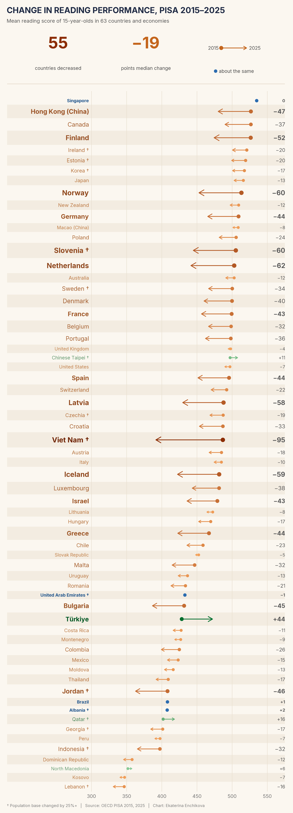

# Change in reading performance, PISA 2015–2025

*Each arrow runs from a country's mean reading score in 2015 (dot) to its score in 2025 (arrowhead). Orange = lower in 2025, green = higher, blue = about the same (under 3 points). Larger changes get larger arrowheads and larger names.*

## Key points

- **55 of 63 countries and economies** scored lower in reading in 2025 than in 2015 (by 3+ points).
- The **median change** across countries was **−19 points**.
- Countries are sorted by their 2015 score (highest at the top). † marks countries where the represented 15-year-old population changed by 25% or more (demography and/or coverage), so the change should be read with caution.

## Important caveats

- **Point estimates only.** Statistical significance (standard errors from the 80 replicate weights, plus link error between cycles) has **not** been tested yet.
- Only countries with the **same sample code in both cycles** are shown (for example, China's 2015 sample B-S-J-G and 2025 sample B-S-J-Z are not comparable and are excluded).
- 2025 means were checked against the OECD's published PISA 2025 reading table.

## Method

Weighted country means (final student weight `W_FSTUWT`), computed separately for each of the 10 plausible values and then averaged.

## Reproduce

Run from the project root (open `PISA2025.Rproj`):

1. `R/03_build_slim_data.R` then `R/04_country_means_2015_2025.R` (shared steps; need the OECD student files in `data/`, which is git-ignored).
2. `studies/reading-change-2015-2025/chart.R` (set `save_outputs <- TRUE` to write the figures).

Source: OECD, PISA 2015 and PISA 2025 student data. Chart: Ekaterina Enchikova.

